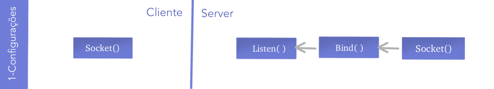
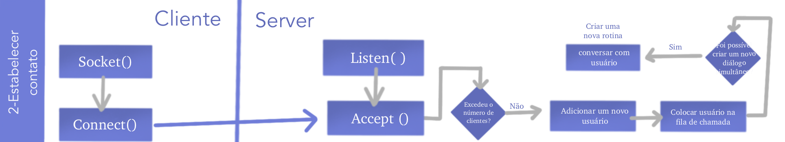

# Em manutenção! ⚠️
[](logo.png)
# Cchat
Projeto- Introdução à programação- semestre 2021.1
## Objetivo
Criar um chat utilizando o paradigma de um socket TCP/IP multithread (pthread/pthread_mutex_t)

## Dependências:
[json-c](https://github.com/json-c/json-c)
| [libuuid](https://linux.die.net/man/3/libuuid)


### Persistindo dados de autenticação
#### formato:
```json

{
"id":"baa5f4eb-1d99-48ad-853d-b417a1942952",
"nome":"joao",
"senha":"1234",
"instante":{
  "hora":11,
  "minuto":48,
  "dia":6,
  "mes":2,
  "ano":2021
  }
}

```

### Servidor:
#### 💻 gcc servidor.c -ljson-c -luuid -o servidor 
#### [](explicacao1.png)
1 - Configura o socket preenchendo a struct sockaddr_in
```C
int configurarSocket(struct sockaddr_in *enderecoSocket, const char *ip, int port){

    int aux = socket(AF_INET, SOCK_STREAM, 0);
    enderecoSocket->sin_family = AF_INET;
    enderecoSocket->sin_addr.s_addr = inet_addr(ip);
    enderecoSocket->sin_port = htons(port);
    return aux;
}
```
2 - Vincular o socket à porta 
```C
 if(bind(escutaDescritor, (struct sockaddr*)&enderecoServidor, sizeof(enderecoServidor)) < 0) {
        perror("Não foi possivel vincular o socket à porta");
        return EXIT_FAILURE;
    }
```
3 - Colocar o socket em modo de espera para possíveis conexões
```C
 if (listen(escutaDescritor, 10) < 0) {
        perror("Não foi possivel em ativar espera por novas conexões");
        return EXIT_FAILURE;
    }
```
#### [](explicacao2.png)

## 👨🏽‍💻 Entendendo o código

## Screenshots

[](screenshot2.png)
[](screenshot1.png)
[](screenshot3.png)
