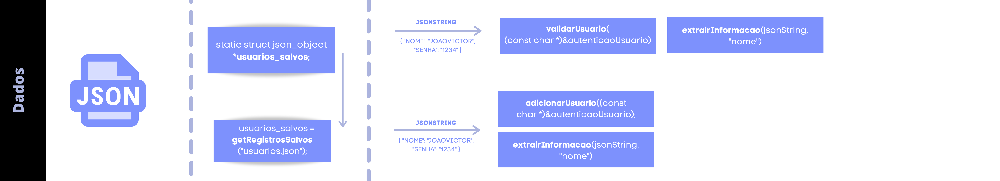
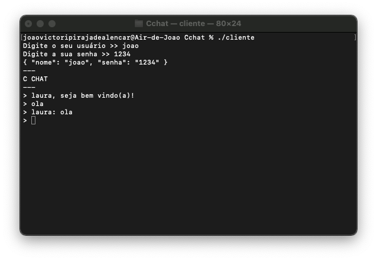
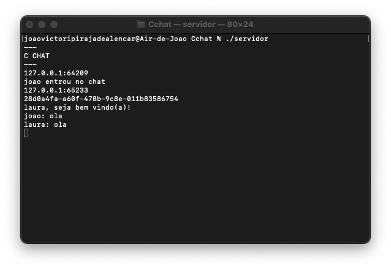

# Em manutenção! ⚠️
[](logo.png)
# Cchat
Projeto- Introdução à programação- semestre 2021.1
## Objetivo
Criar um chat utilizando o paradigma de um socket TCP/IP multithread (pthread/pthread_mutex_t)

### 💻 Executar
#### gcc servidor.c -ljson-c -luuid -o servidor 
#### gcc cliente.c -ljson-c -o cliente

## Dependências:
[json-c](https://github.com/json-c/json-c)
| [libuuid](https://linux.die.net/man/3/libuuid)

## 👨🏽‍💻 Entendendo o código

### Persistindo dados de autenticação
#### [](5.png)

#### formato:
```json

{
"id":"baa5f4eb-1d99-48ad-853d-b417a1942952",
"nome":"joao",
"senha":"1234",
"instante":{
  "hora":11,
  "minuto":48,
  "dia":6,
  "mes":2,
  "ano":2021
  }
}

```

#### Recuperando dados do arquivo usuarios.json
```C
static struct json_object *usuarios_salvos;
struct json_object* getRegistrosSalvos(const char *fileName){

    FILE *fp = NULL;
    struct json_object *parsed_json;
    char buffer[1024] = "";

    fp = fopen(fileName,"r");
    fread(buffer,sizeof(buffer),1,fp);
    fclose(fp);

    if(strlen(buffer) > 0){ //caso o arquivo não esteja vazio
        parsed_json = json_tokener_parse(buffer); //converte o buffer do arquivo para json_object
    }else{
        parsed_json = json_object_new_array(); //inicializa a variável json_object como array de json_objects
    }

    return parsed_json;

}
void inicializar_banco_de_dados(){
    usuarios_salvos = getRegistrosSalvos("usuarios.json");
}

```
#### Validação usuário
- 1 > O usuario nao existe
- 2 > O usuario existe, mas a senha está incorreta
- 3 > O usuario existe e a senha está correta

```C
int validarUsuario(const char *jsonString){

    int resposta = 1;
    const char *n =  extrairInformacao(jsonString, "nome");
    const char *s = extrairInformacao(jsonString, "senha");

    struct json_object *usuario;
    struct json_object *nome;
    struct json_object *senha;

    size_t n_usuarios = json_object_array_length(usuarios_salvos);
    size_t i;

    for (i = 0; i<n_usuarios; i++){
        usuario = json_object_array_get_idx(usuarios_salvos,i);
        json_object_object_get_ex(usuario, "nome", &nome);
        json_object_object_get_ex(usuario, "senha", &senha);

        if(strcmp(json_object_get_string(nome),n) == 0){
            break;
        }
    }


    if (strcmp(json_object_get_string(nome),n) == 0 && strcmp(json_object_get_string(senha),s) != 0){
        resposta = 2;
    }else if (strcmp(json_object_get_string(nome),n) == 0 && strcmp(json_object_get_string(senha),s) == 0){
        resposta = 3;
    }

    return resposta;
}
```
#### Adicionando novos usuários

```C

struct json_object* gerarTempo(){

    struct tm * timeinfo;
    time_t my_time;
    time (&my_time);
    timeinfo = localtime (&my_time);

    struct json_object *tempo = json_object_new_object();

    json_object_object_add(tempo, "hora", json_object_new_int(timeinfo->tm_hour));
    json_object_object_add(tempo, "minuto", json_object_new_int(timeinfo->tm_min));
    json_object_object_add(tempo, "dia", json_object_new_int(timeinfo->tm_mday));
    json_object_object_add(tempo, "mes", json_object_new_int(timeinfo->tm_mon+1));
    json_object_object_add(tempo, "ano", json_object_new_int(timeinfo->tm_year+1900));


    return tempo;
}

void gerarUUID(char *uuid_str){
    uuid_t uuid;
    uuid_generate_random(uuid);
    uuid_unparse_lower(uuid, uuid_str);
}


int adicionarUsuario(const char *jsonString){

    //recebe um json do tipo { "nome": "NOMEUSUARIO", "senha": "SENHADOUSUARIO" }

    int resposta = 0;
    const char *nome =  extrairInformacao(jsonString, "nome");
    const char *senha = extrairInformacao(jsonString, "senha");

    struct json_object *usuario;
    char uuid_str[36];
    if(strlen(nome) > 0 && strlen(senha) > 0 && validarUsuario(jsonString) == 1){ //Validação

        usuario = json_object_new_object();
        gerarUUID(uuid_str);

        printf("%s\n",uuid_str);

        json_object_object_add(usuario, "id", json_object_new_string(uuid_str));
        json_object_object_add(usuario, "nome", json_object_new_string(nome));
        json_object_object_add(usuario, "senha", json_object_new_string(senha));
        json_object_object_add(usuario, "instante", gerarTempo());

        json_object_array_add(usuarios_salvos,usuario);
        json_object_to_file("usuarios.json",usuarios_salvos);

        resposta = 1;
    }

    return resposta;

}

```


#### [](1.png)

```C
int configurarSocket(struct sockaddr_in *enderecoSocket, const char *ip, int port){

    int aux = socket(AF_INET, SOCK_STREAM, 0);
    enderecoSocket->sin_family = AF_INET;
    enderecoSocket->sin_addr.s_addr = inet_addr(ip);
    enderecoSocket->sin_port = htons(port);
    return aux;
}
```
#### Cliente:

1- Configura o socket preenchendo a struct sockaddr_in

```C
    descritorServidor = configurarSocket(&enderecoServidor, "127.0.0.1", 1247);
```

#### Servidor:
1 - Configura o socket preenchendo a struct sockaddr_in

```C
  escutaDescritor = configurarSocket(&enderecoServidor, "127.0.0.1", 1247);
```

2 - Vincular o socket à porta 
```C
 if(bind(escutaDescritor, (struct sockaddr*)&enderecoServidor, sizeof(enderecoServidor)) < 0) {
        perror("Não foi possivel vincular o socket à porta");
        return EXIT_FAILURE;
    }
```
3 - Colocar o socket em modo de espera para possíveis conexões
```C
 if (listen(escutaDescritor, 10) < 0) {
        perror("Não foi possivel em ativar espera por novas conexões");
        return EXIT_FAILURE;
    }
```

#### [](2.png)
#### Cliente:
```C
if (conectar(&enderecoServidor,descritorServidor)) {
        printf("Houve um erro na conexão com o servidor\n");
        return EXIT_FAILURE;
    }
```
#### Servidor:

```C
typedef struct{
    int id;
    char nome[TAMANHO_NOME];
    struct sockaddr_in endereco;
    int descritor;
} usuario;

usuario *usuarios[MAXIMO_USUARIOS];

usuario * criarNovoUsuario(struct sockaddr_in endereco, int descritor){
    usuario *usr = (usuario *)malloc(sizeof(usuario));
    usr->endereco = endereco;
    usr->descritor = descritor;
    usr->id = id++;
    return usr;
}
```

```C
int criarNovoDialogoSimultaneo(pthread_t *novaThread, void *usr){
    return (pthread_create(novaThread, NULL, &conversarComUsuario, usr) == 0);
}
```
```C
    while(1){

        descritorNovaConexao = aceitarConexao(escutaDescritor,&enderecoCliente);

        if((contarUsuarios + 1) == MAXIMO_USUARIOS){
            printf("Número máximo de usuários atingido!");
            mostrarEnderecoCliente(enderecoCliente);
            printf(":%d\n", enderecoCliente.sin_port);
            close(descritorNovaConexao);
            continue;
        }

        usuario *usr = criarNovoUsuario(enderecoCliente, descritorNovaConexao);

        adicionarUsuarioNaFila(usr);

        if(criarNovoDialogoSimultaneo(&thread,(void*)usr)){
            printf("Error em criar uma thread\n");
        }

        sleep(1); //reduz o uso da CPU
    }
    
```
#### [](3.png)
#### [](4.png)


## Screenshots

[](screenshot2.png)
[](screenshot1.png)
[](screenshot3.png)
